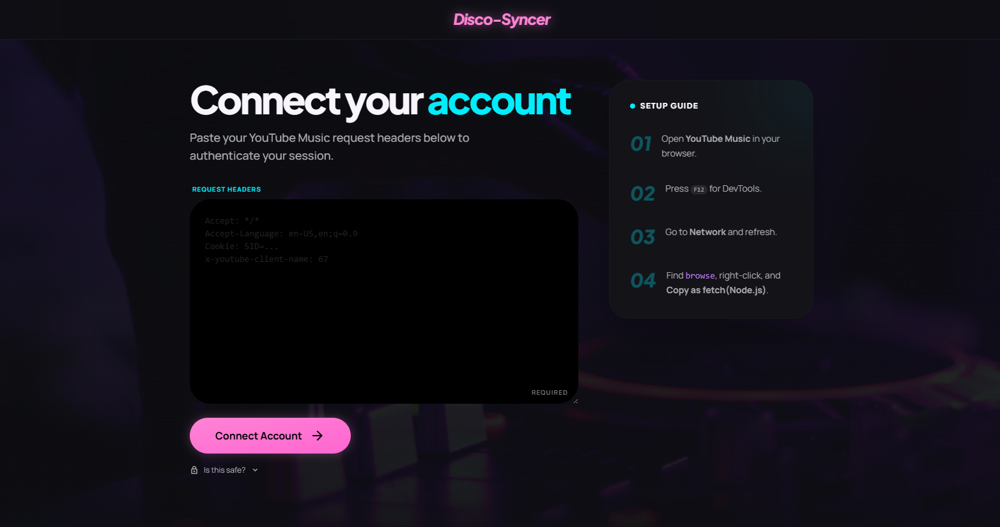
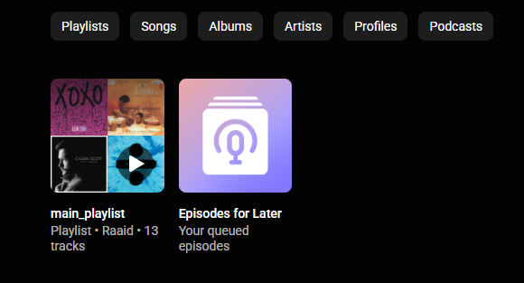
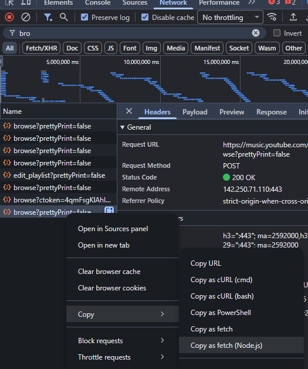
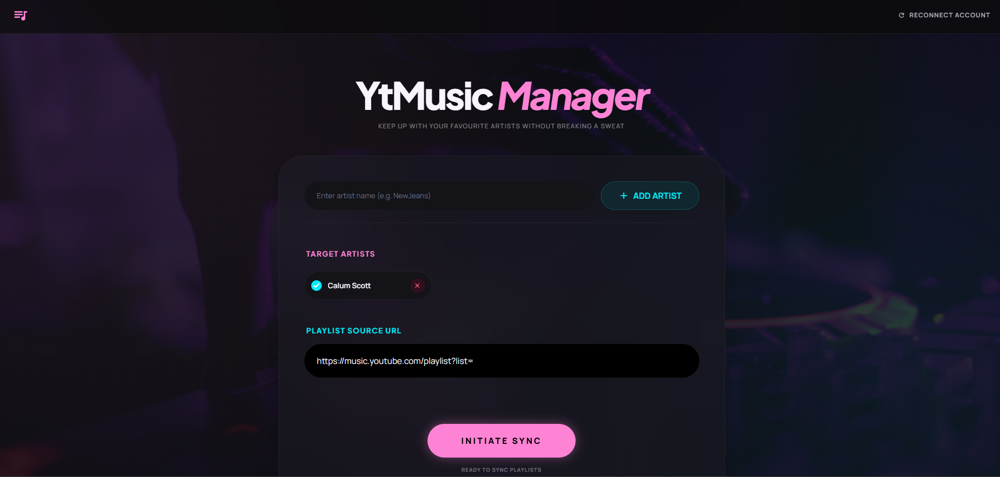
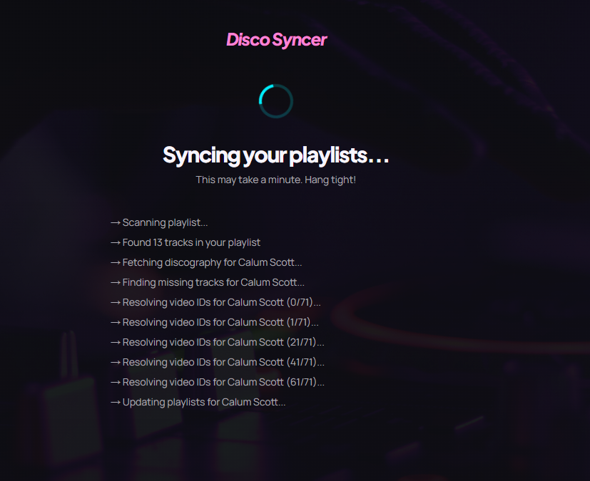
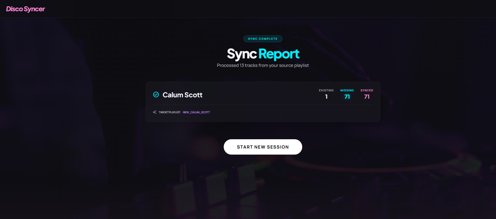
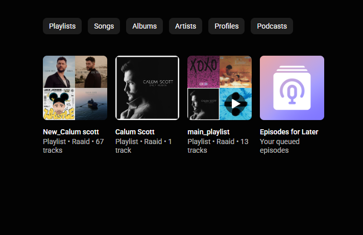

# Disco Syncer 🎵

> Keep up with your favourite artists without breaking a sweat.

A Python/Flask web app that scans your YouTube Music playlist, organises tracks by artist into dedicated playlists, and cross-references against MusicBrainz to find every song you're missing.

**Live Demo → [disco-syncer.up.railway.app](https://ytmusic-kpop-tool.onrender.com)**

---

## Screenshots

### Connect Your Account


### Library Before Running the Tool


### How to Copy the Headers


### Dashboard


### Real-Time Sync Progress


### Sync Report


### Playlists Created in YouTube Music


---

## What It Does

1. **Scans** a YouTube Music playlist URL you provide
2. **Filters** tracks by your chosen artists
3. **Creates** a dedicated playlist per artist (e.g. `Calum Scott`) with songs already in your library
4. **Cross-references** MusicBrainz discography data to find every song you're missing
5. **Creates** a `new_artistname` playlist with those missing songs added automatically

---

## Tech Stack


| Layer | Technology |
|---|---|
| Backend | Python 3.11 + Flask |
| YouTube Music | ytmusicapi (cookie-based) |
| Discography | MusicBrainzngs + 30-day local cache |
| Frontend | Tailwind CSS + vanilla JS |
| Real-time | Server-Sent Events (SSE) |
| Hosting | Railway (auto-deploy from GitHub) |

---

## Features

- 🔐 **Secure session auth** — cookies stored only in your browser session, never on disk
- 📡 **Real-time progress** — live step-by-step updates via SSE while syncing
- 🎯 **Per-artist playlists** — one playlist for existing tracks, one for missing tracks
- ➕ **Add/remove artists** — persistent config saved across restarts
- 🔄 **Reconnect account** — refresh cookies without losing your artist list
- 📋 **Sync report** — clear summary of existing, missing, and synced tracks per artist

---

## How It Works

```
User submits playlist URL + artists
        ↓
POST /run → saves to session → redirects to /loading
        ↓
EventSource opens /stream → Flask generator streams progress
        ↓
For each artist:
  → Filter tracks from playlist
  → Fetch full discography from MusicBrainz
  → Find missing songs (set difference)
  → Resolve YouTube video IDs via search
  → Create/update playlists via ytmusicapi
        ↓
Final SSE event → browser redirects to /results
```

---

## Setup & Local Development

### Prerequisites
- Python 3.11+
- A YouTube Music account

### Installation

```bash
git clone https://github.com/Raaid-Shaheer/ytmusic_kpop_tool
cd ytmusic_kpop_tool
python -m venv venv
source venv/bin/activate    # Mac/Linux
venv\Scripts\activate       # Windows
pip install -r requirements.txt
# add a secret key in app.py
python app.py               # runs on localhost:5000
```

### Authentication

Since YouTube Music has no official API, the app uses your browser cookies:

1. Open [YouTube Music](https://music.youtube.com) in your browser
2. Press `F12` to open DevTools
3. Go to the **Network** tab and refresh the page
4. Find a `browse` request, right-click → **Copy as fetch (Node.js)**
5. Paste into the setup page and click **Connect Account**

> Your credentials are stored only in your browser session and are never written to a database or disk.

---

## Project Structure

```
ytmusic_kpop_tool/
├── app.py                    Flask routes + SSE streaming
├── config.py                 Artist list + source playlist URL
│
├── auth/
│   ├── auth_manager.py       Per-request YTMusic instance
│   ├── header_parser.py      Parses raw + fetch format headers
│   └── exceptions.py         Custom exceptions
│
├── clients/
│   ├── ytmusic_client.py     YouTube Music API calls
│   └── musicbrainz_client.py MusicBrainz API + pagination
│
├── core/
│   ├── playlist_scanner.py   Scans playlist → list of Tracks
│   ├── discography_fetcher.py MusicBrainz + 30-day cache
│   ├── track_matcher.py      Filter, diff, match tracks
│   └── playlist_manager.py   Create/update/rebuild playlists
│
├── models/
│   └── track.py              Track dataclass
│
└── templates/
    ├── index.html            Main dashboard
    ├── setup.html            Auth setup page
    ├── loading.html          SSE progress screen
    └── results.html          Sync report
```

---

## Deployment

Hosted on [Railway](https://railway.app) with auto-deploy on push to `main`.

| Setting | Value |
|---|---|
| Start command | `gunicorn app:app --timeout 300` |
| Environment variable | `SECRET_KEY` |
| Uptime monitoring | UptimeRobot pings `/` every 5 minutes |

---

## Known Limitations

- **First sync is slow** for artists with large discographies (MusicBrainz rate limit: 1 req/sec). Subsequent runs use a local cache and are significantly faster.
- **Railway filesystem is ephemeral** — MusicBrainz cache is lost on redeploy.
- **No official YouTube Music API** — authentication via browser cookies which expire periodically. Use the "Reconnect Account" button to refresh.

---

## Roadmap

- [ ] Background job processing (Redis + Celery) for long-running syncs
- [ ] Blacklist playlist — skip songs you don't want added
- [ ] Pre-fetch discographies when an artist is added
- [ ] Persistent video ID cache across restarts

---

## License

MIT
